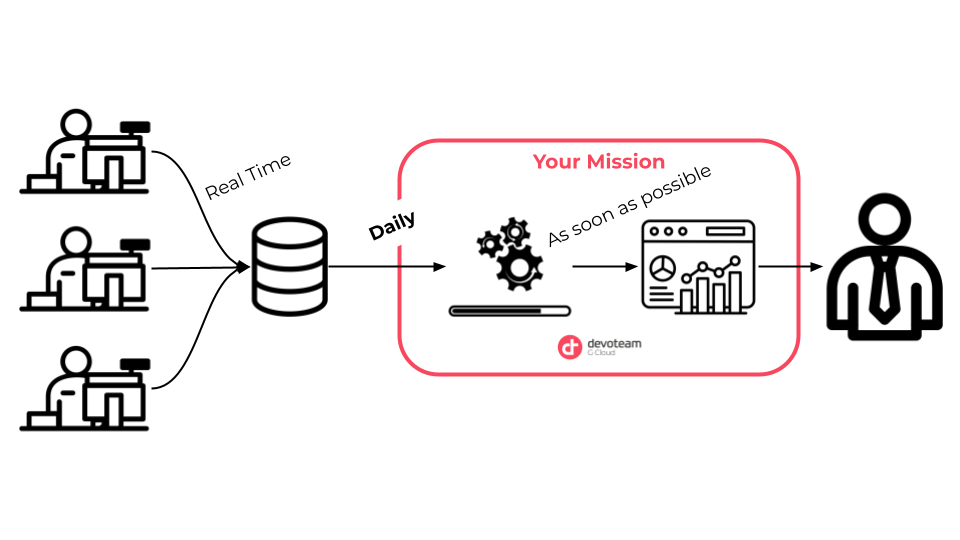

# Learning Practical Path 

This README is here to explain the step by step learning path from Zero to Hero as a Data Engineer. 

As a new comer, Devoteam G Cloud has given you your first real mission. Do not be afraid, it is not for real, but it is realistic. If you finish your journey, you will be completely able to realize a wonderful mission for your next-to-come clients. 

This learning path, as it names indicates, is a practical path to learn as much as possible in a shorter period. It will be intense but really funny as you will learn through a near-real context. 

Your project is big, but it will be broken into small steps. In each step, you will have:
- **a context**: you will not be asked to do this or that for no reason. Everything will be related to a customer requirement which is common in our job.
- **learning ressources**: at each step, you will earn something new. It is not a rush, take your time, go through every ressources we will provide. Take your time to understand everything things well and do not hesitate to complete this with other ressources you will find. You will be asked to be more and more autonomous.
- **a mission**: learning by doing is the best approach to learn new stuff. You will be guided in your mission. You can have objective to complete (must to have), objectives to improve your work (nice to have) and objective to perfect your job (great to have). You are not forced to complete the nice and great to have. Enjoy your mission this is what matters ! 😎

```
Pro tips: 
We cannot repeat it enough, but take your time, do not hesitate to look for other resources on Google documentations, StackOverflow and even from your great new colleagues. 
```

Of course, this Learning Practical Path is focused on what a Data Engineer must know and do in it daily life. 
So the main external ressource will be the [Google Certified Professional Data Engineer](https://learn.acloud.guru/course/gcp-certified-professional-data-engineer/) from [A Cloud Guru](https://acloudguru.com/) which is a awesome courses. 

You will probably begin with the Cloud Digital Leader or the Associate Cloud Engineer, so you can ask to your manager hwo to prioritize this. 


## 0 - Quick introduction to Data processing fundamentals. (2 days)

**Context** : In a retail context, we were chosen by the company Magasin & Cie to meet a need of managers. The latter would like to have a daily overview of the sales and customers who bought in their store via a personalized dashboard. 

At Magasin & Cie, each cash register records purchases in real time and sends them to the internal database of all stores. The data is stored in different formats but is not processed. For the time being, it is only used to keep track of the transactions made at Magasin & Cie.

The data and KPIs of the reporting are clearly defined and thanks to the great work of our sales team and Devoteam's Tech Lead, the file interface contracts and the different mapping are already established.

(explain what a KPI is, what an interface contract is, what mapping is)

Your role at Devoteam :
Your objective is, first of all, to process the data to extract the important information in the best possible way. Then to make it accessible at any time by creating a dashboard that managers can view at any time.




**Learn** : [Google Certified Associate Cloud Engineer 2020](https://learn.acloud.guru/course/gcp-certified-associate-cloud-engineer/dashboard) Chapters 1-4 to introduce GCP (maybe also 5-7 to introduce firsts steps and basic services)

**Do** :
- **must to have** :
- **nice to have** :
- **great to have** :


## 

**Context** : 
**Learn** :
**Do** :

## 

**Context** : 
**Learn** :
**Do** :

## 

**Context** : 
**Learn** :
**Do** :

## 

**Context** : 
**Learn** :
**Do** :

## 

**Context** : 
**Learn** :
**Do** :

## 

**Context** : 
**Learn** :
**Do** :

## 

**Context** : 
**Learn** :
**Do** :

## 

**Context** : 
**Learn** :
**Do** :

## 

**Context** : 
**Learn** :
**Do** :


https://learn.acloud.guru/course/gcp-certified-associate-cloud-engineer/dashboard


## Check box of what it learn by now
[]
